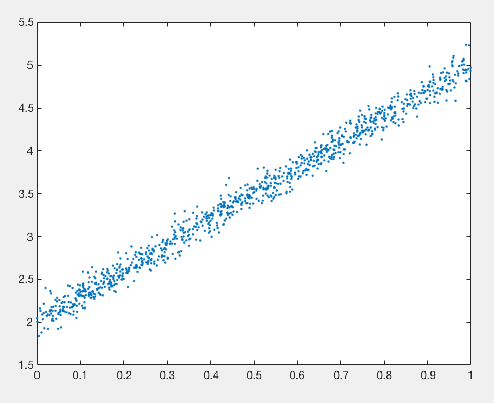
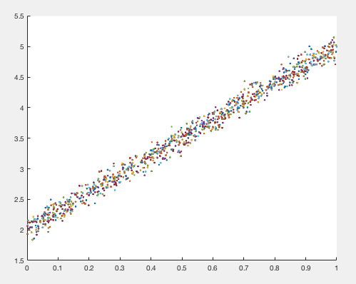

# Adam optimiser
This is a `Matlab` implementation of the Adam optimiser from Kingma and Ba [[1]], designed for stochastic gradient descent. It maintains estimates of the moments of the gradient independently for each parameter.

## Usage
` [x, fval, exitflag, output] = fmin_adam(fun, x0 <, stepSize, beta1, beta2, epsilon, nEpochSize, options>)`

`fmin_adam` is an implementation of the Adam optimisation algorithm (gradient descent with Adaptive learning rates individually on each parameter, with Momentum) from Kingma and Ba [[1]]. Adam is designed to work on stochastic gradient descent problems; i.e. when only small batches of data are used to estimate the gradient on each iteration, or when stochastic dropout regularisation is used [[2]].

## Examples
###Simple regression problem with gradients

Set up a simple linear regression problem: , where . We'll take ![$$$\phi = \left[3, 2\right]$$$](https://latex.codecogs.com/svg.latex?%5Cinline%20%5Cphi%20%3D%20%5Cleft%5B3%2C%202%5Cright%5D) for this example. Let's draw some samples from this problem:

```matlab
nDataSetSize = 1000;
vfInput = rand(1, nDataSetSize);
phiTrue = [3 2];
fhProblem = @(phi, vfInput) vfInput .* phi(1) + phi(2);
vfResp = fhProblem(phiTrue, vfInput) + randn(1, nDataSetSize) * .1;
plot(vfInput, vfResp, '.'); hold;
```



Now we define a cost function to minimise, which returns analytical gradients:

```matlab
function [fMSE, vfGrad] = LinearRegressionMSEGradients(phi, vfInput, vfResp)
   % - Compute mean-squared error using the current parameter estimate
   vfRespHat = vfInput .* phi(1) + phi(2);
   vfDiff = vfRespHat - vfResp;
   fMSE = mean(vfDiff.^2) / 2;
   
   % - Compute the gradient of MSE for each parameter
   vfGrad(1) = mean(vfDiff .* vfInput);
   vfGrad(2) = mean(vfDiff);
end
```

Initial parameters `phi0` are Normally distributed. Call the `fmin_adam` optimiser with a learning rate of 0.01.

```matlab
phi0 = randn(2, 1);
phiHat = fmin_adam(@(phi)LinearRegressionMSEGradients(phi, vfInput, vfResp), phi0, 0.01)
plot(vfInput, fhProblem(phiHat, vfInput), '.');
````

Output:

     Iteration   Func-count         f(x)   Improvement    Step-size
    ----------   ----------   ----------   ----------   ----------
          2130         4262       0.0051        5e-07      0.00013
    ----------   ----------   ----------   ----------   ----------

    Finished optimization.
       Reason: Function improvement [5e-07] less than TolFun [1e-06].

    phiHat =
        2.9498
        2.0273


###Linear regression with minibatches

Set up a simple linear regression problem, as above.

```matlab
nDataSetSize = 1000;
vfInput = rand(1, nDataSetSize);
phiTrue = [3 2];
fhProblem = @(phi, vfInput) vfInput .* phi(1) + phi(2);
vfResp = fhProblem(phiTrue, vfInput) + randn(1, nDataSetSize) * .1;
```

Configure minibatches. Minibatches contain random sets of indices into the data.

```matlab
nBatchSize = 50;
nNumBatches = 100;
mnBatches = randi(nDataSetSize, nBatchSize, nNumBatches);
cvnBatches = mat2cell(mnBatches, nBatchSize, ones(1, nNumBatches));
figure; hold;
cellfun(@(b)plot(vfInput(b), vfResp(b), '.'), cvnBatches);
```

       
Define the function to minimise; in this case, the mean-square error over the regression problem. The iteration index `nIter` defines which mini-batch to evaluate the problem over.

```matlab
fhBatchInput = @(nIter) vfInput(cvnBatches{mod(nIter, nNumBatches-1)+1});
fhBatchResp = @(nIter) vfResp(cvnBatches{mod(nIter, nNumBatches-1)+1});
fhCost = @(phi, nIter) mean((fhProblem(phi, fhBatchInput(nIter)) - fhBatchResp(nIter)).^2);
```
Turn off analytical gradients for the `adam` optimiser, and ensure that we permit sufficient function calls.

```matlab
sOpt = optimset('fmin_adam');
sOpt.GradObj = 'off';
sOpt.MaxFunEvals = 1e4;
```

Call the `fmin_adam` optimiser with a learning rate of `0.1`. Initial parameters are Normally distributed.

```matlab
phi0 = randn(2, 1);
phiHat = fmin_adam(fhCost, phi0, 0.1, [], [], [], [], sOpt)
```
The output of the optimisation process (which will differ over random data and random initialisations):

    Iteration   Func-count         f(x)   Improvement    Step-size
    ----------   ----------   ----------   ----------   ----------
           711         2848          0.3       0.0027      3.8e-06
    ----------   ----------   ----------   ----------   ----------

    Finished optimization.
       Reason: Step size [3.8e-06] less than TolX [1e-05].

    phiHat =
        2.8949
        1.9826
    
## Detailed usage
### Input arguments
`fun` is a function handle `[fCost <, vfCdX>] = @(x <, nIter>)` defining the function to minimise . It must return the cost at the parameter `x`, optionally evaluated over a mini-batch of data. If analytical gradients are available (recommended), then `fun` must return the gradients in `vfCdX`, evaluated at `x` (optionally over a mini-batch). If analytical gradients are not available, then complex-step finite difference estimates will be used.

To use analytical gradients (default), set `options.GradObj = 'on'`. To force the use of finite difference gradient estimates, set `options.GradObj = 'off'`.

`fun` must be deterministic in its calculation of `fCost` and `vfCdX`, even if mini-batches are used. To this end, `fun` can accept a parameter `nIter` which specifies the current iteration of the optimisation algorithm. `fun` must return estimates over identical problems for a given value of `nIter`.

Steps that do not lead to a reduction in the function to be minimised are not taken.

### Output arguments
`x` will be a set of parameters estimated to minimise `fCost`. `fval` will be the value returned from `fun` at `x`.
 
`exitflag` will be an integer value indicating why the algorithm terminated:

* 0: An output or plot function indicated that the algorithm should terminate.
* 1: The estimated reduction in 'fCost' was less than TolFun.
* 2: The norm of the current step was less than TolX.
* 3: The number of iterations exceeded MaxIter.
* 4: The number of function evaluations exceeded MaxFunEvals.
 
`output` will be a structure containing information about the optimisation process:

*      `.stepsize` — Norm of current parameter step
*      `.gradient` — Vector of current gradients evaluated at `x`
*      `.funccount` — Number of calls to `fun` made so far
*      `.iteration` — Current iteration of algorithm
*      `.fval` — Value returned by `fun` at `x`
*      `.exitflag` — Flag indicating reason that algorithm terminated
*      `.improvement` — Current estimated improvement in `fun`
 
The optional parameters `stepSize`, `beta1`, `beta2` and `epsilon` are  parameters of the Adam optimisation algorithm (see [[1]]). Default values  of `{1e-3, 0.9, 0.999, sqrt(eps)}` are reasonable for most problems.
 
The optional argument `nEpochSize` specifies how many iterations comprise  an epoch. This is used in the convergence detection code.
 
The optional argument `options` is used to control the optimisation process (see `optimset`). Relevant fields:

*      `.Display`
*      `.GradObj`
*      `.DerivativeCheck`
*      `.MaxFunEvals`
*      `.MaxIter`
*      `.TolFun`
*      `.TolX`
*      `.UseParallel`

## References
[[1]] Diederik P. Kingma, Jimmy Ba. "Adam: A Method for Stochastic
         Optimization", ICLR 2015. [https://arxiv.org/abs/1412.6980](https://arxiv.org/abs/1412.6980)

[[2]] Geoffrey E Hinton, Nitish Srivastava, Alex Krizhevsky, Ilya Sutskever, and Ruslan R. Salakhutdinov. "Improving neural networks by preventing co-adaptation of feature detectors." arXiv preprint. [https://arxiv.org/abs/1207.0580](https://arxiv.org/abs/1207.0580)


[1]: https://arxiv.org/abs/1412.6980
[2]: https://arxiv.org/abs/1207.0580

